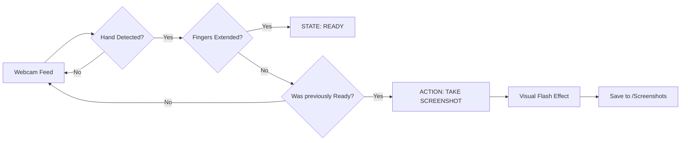
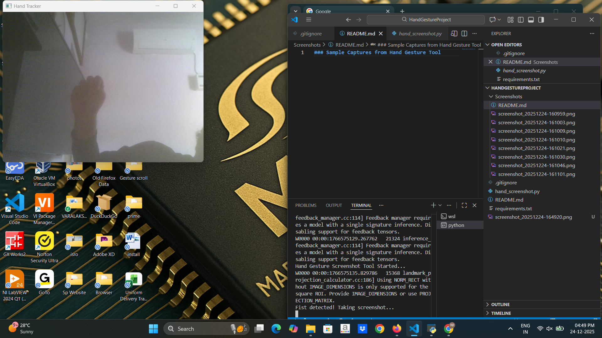

# 🖐️ Hand Gesture Screenshot Tool 📸

A high-performance computer vision application that captures your desktop using real-time hand gesture recognition. Built with Python, this tool allows for hands-free interaction by detecting transitions between an open palm and a closed fist.

## 🌟 Features
- **Real-time Detection:** Powered by MediaPipe's 21-point hand landmark model.
- **State-Based Trigger:** Uses a "Ready -> Capture" state machine to prevent accidental triggers.
- **High Performance:** Utilizes `mss` for ultra-fast screen grabbing with minimal CPU overhead.
- **Visual HUD:** Real-time on-screen display (HUD) showing system status and capture confirmation.

## 🛠️ How it Works (Graphical Flow)

The system operates on a state-machine logic to ensure accuracy.

🚀 Installation & Setup
1. Clone the Repository
git clone [https://github.com/SIDDUSPACE/Hand-Gesture-Screenshot-Tool.git](https://github.com/SIDDUSPACE/Hand-Gesture-Screenshot-Tool.git)
cd Hand-Gesture-Screenshot-Tool

2. Install Dependencies
   
pip install -r requirements.txt

3. Run the Application
   
python hand_screenshot.py

📂 Project Structure

Hand-Gesture-Screenshot-Tool/

├── hand_screenshot.py    

├── requirements.txt     

├── .gitignore          

└── Screenshots/        

👨‍💻 Developed By

Siddarth S ECE Student | Embedded Systems & Linux Enthusiast Portfolio | LinkedIn- https://www.linkedin.com/in/siddarth-s-embedded/

